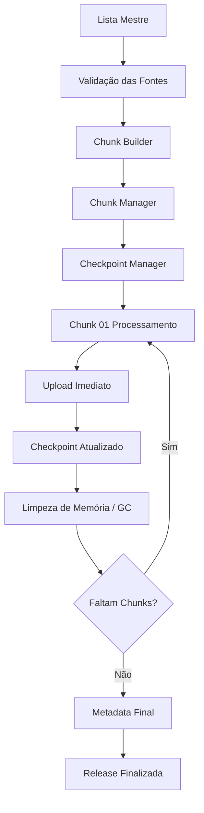

# IOC Pipeline (GuardTron)

Pipeline de processamento e distribuição de Indicadores de Comprometimento (IOC) utilizado pelo GuardTron. 
O pipeline agora utiliza uma **Arquitetura Baseada em Chunks** para garantir resiliência, tolerância a falhas (com checkpoints) e baixo uso de memória através da orquestração particionada de fontes de inteligência.

## 🚀 Arquitetura e Fluxo

O sistema adota processamento isolado onde a Lista Mestre de Fontes é dividida em blocos lógicos menores, processados um a um.



### Componentes Principais

* **Chunk Builder**: Carrega a Lista Mestre (de `sources.json`), divide automaticamente em $N$ partes e aloca eventuais sobras no último chunk. Não efetua requisições nem parsing;
* **Chunk Manager**: Orquestrador central. Carrega estados, executa o `IOCPipeline` para cada chunk e aciona uploads parciais e operações de limpeza (GC) a cada iteração;
* **Checkpoint Manager**: Garante **retomada automática**. A cada passo ou fim de chunk, um estado persistente em `checkpoint.json` é atualizado. Em caso de falha (queda, OOM, timeout), o pipeline continuará de onde parou sem precisar rebaixar ou reprocessar os chunks anteriores;
* **Upload Parcial**: Os uploads agora vão direto para a *Edge Function* do Supabase ao término de cada chunk, publicando partes como `ads.part001.zst`.

## 📦 Estrutura dos Arquivos de Saída

Cada categoria (ex: `ads`, `malware`) será particionada da seguinte forma e com compressão por prioridade (Zstd > Brotli > Gzip):
```
ads.part001.zst
ads.part002.zst
ads.part003.zst
ads.part004.zst
```

## 🛠 Como Executar

> Todo o projeto foi otimizado e configurado para o **Bun**.

### Variáveis de Ambiente
Copie `.env-example` para `.env` e configure (API Key de upload e variáveis de Publish, etc).

### Iniciando o Pipeline
O Chunk Manager assumirá o controle:
```bash
bun run src/index.ts
```

*(Caso o processo caia ou sofra interrupção, basta rodar o mesmo comando novamente. O Checkpoint atuará para continuar a partir do Chunk e/ou Estágio não concluído).*

## 📊 Estrutura do Checkpoint

Mantido no diretório temporário/output:
```json
{
    "runId": "release-v18-17192301938",
    "release": 18,
    "totalChunks": 4,
    "currentChunk": 2,
    "currentStage": "UPLOAD",
    "completedChunks": [
        1
    ],
    "status": "RUNNING",
    "startedAt": "2026-07-04T00:00:00Z",
    "updatedAt": "2026-07-04T00:05:00Z"
}
```

O Metadata final será construído apenas no encerramento global de todos os chunks:
```json
{
    "version": 18,
    "chunks": 4,
    "categories": {
        "ads": [
            "ads.part001.zst",
            "ads.part002.zst",
            "ads.part003.zst",
            "ads.part004.zst"
        ]
    }
}
```

## 🧹 Limpeza
Ao final de cada chunk (e se o pipeline abortar controladamente), o componente `StageBuilder` descarta os caminhos temporários (`*.tmp.json`) para prevenir poluição em disco, e o interpretador dispara o `global.gc()` sob demanda para liberar buffers alocados pelo ShardEngine.
